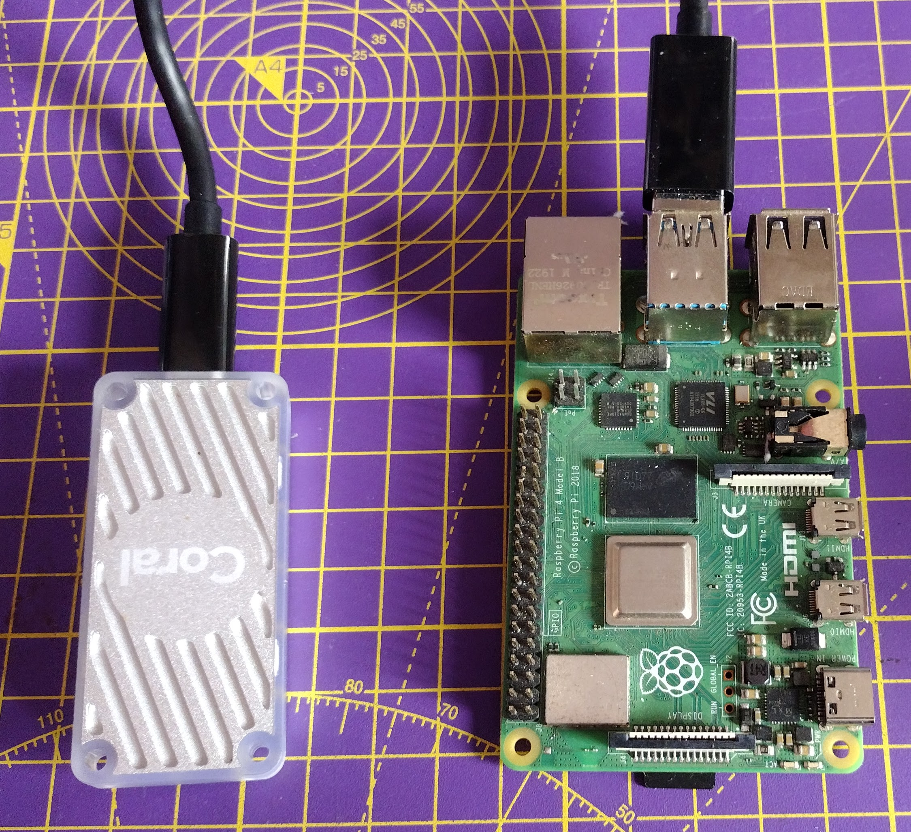

## Introduction

In this project, you will retrain a machine learning model using a Coral TPU, and then use it to recognise images.

**Machine learning** is a form of Artificial Intelligence. In image classification, a **model** is trained to recognise different classes of images.

{:width="300px"}

You will:
+ Retrain a machine learning model to recognise new image classes
+ Use the Google Coral's TPU to classify images
+ Have the opportunity to enter the [Mission Space Lab](https://astro-pi.org/mission-space-lab/) competition and run machine learning algorithms on the International Space Station
