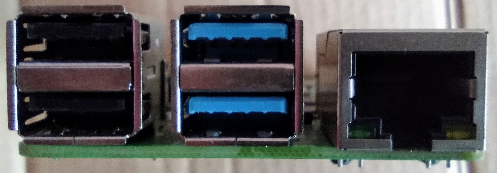
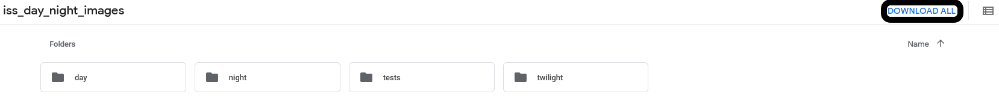

## Set up your Corel and gather your images

<div style="display: flex; flex-wrap: wrap">
<div style="flex-basis: 200px; flex-grow: 1; margin-right: 15px;">
There are many machine learning models that have been trained to identify different classes of images. These can easily be retrained to identify new classes.
</div>
<div>
{:width="300px"}
</div>
</div>

On your Raspberry Pi, you will need to install the software needed to use your Corel TPU with Python.

--- task ---

With your [Raspberry Pi setup](https://projects.raspberrypi.org/en/projects/raspberry-pi-getting-started) and your Corel TPU **disconnected**, you can open a **terminal** and run the following command. This will install the Corel Python library and its dependencies.

```bash
wget -O - https://raw.githubusercontent.com/raspberrypilearning/image-id-coral/master/en/resources/install_script.sh | bash
```

--- /task ---

--- collapse ---
---
title: What's in that script?
---

If you would rather install the software manually, you can do so with the following commands, entered into the terminal.

```bash
echo "deb https://packages.cloud.google.com/apt coral-edgetpu-stable main" | sudo tee /etc/apt/sources.list.d/coral-edgetpu.list
curl https://packages.cloud.google.com/apt/doc/apt-key.gpg | sudo apt-key add -
sudo apt-get update
sudo apt-get install libedgetpu1-std python3-pycoral -y
```

--- /collapse ---

--- task ---

Once the software has been installed, you can plug in your Coral device to one of the USB ports. We recommend the USB 3 ports, which you can identify because they are blue.



--- /task ---

You can choose to retrain a machine learning model in two different ways, either on your computer using a Python script or using Google's [Teachable Machine](https://teachablemachine.withgoogle.com/){:target="_blank"} site.

Either way, you will need a set of classified images to begin with. The simplest way to classify images is to move them into named directories, where the directory name is the class name. You will want to have some images in a separate directory for testing.


--- task ---

You can create directories on your computer for all your different image classes and manually move your collections of images into the directories

Alternatively or you can download a set of images captured from the International Space Station [here](https://drive.google.com/drive/folders/1owb4zoZzSMld5qX0edCwZ1qZ6ypnJQ_5){:target="_blank"} that have been classified already.



--- /task ---

--- collapse ---
---
title: How were these images taken?
---

The sets of images available for you to download have all been taken using an Astro Pi computer on the ISS, that we have nicknamed Izzy. Izzy has a near-infrared camera attached, and aimed through a window on the ISS to point at Earth.

The images taken have been classified into **day**, **night** and **twilight** classes. Some images have also been kept back for use in **testing**.


Sometimes it is useful to know if the ISS is currently experiencing day, night or twilight, as this may have an effect on other measurements that are being taken. Classifying such images could therefore be useful.

--- /collapse ---

--- task ---

If you want to retrain a model using [Teachable Machine](https://teachablemachine.withgoogle.com/){:target="_blank"} then move onto the next step.

If you want to retrain a model on your computer then move on to [Retrain a model with a script](3).

--- /task ---