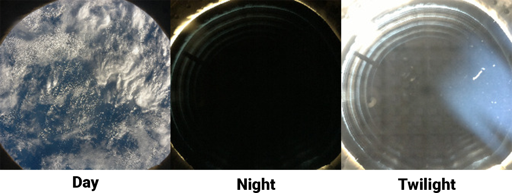
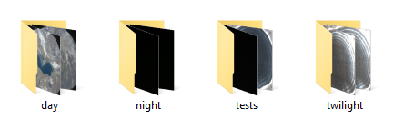

## Gather your images

There are many machine learning models that have been trained to identify different classes of images. These can easily be retrained to identify new classes.

{:width="300px"}

You can choose to retrain a machine learning model in two different ways, either on your computer using a Python script or using Google's [Teachable Machine](https://teachablemachine.withgoogle.com/){:target="_blank"} site.

Either way, you will need a set of classified images to begin with. The simplest way to classify images is to move them into named directories, where the directory name is the class name. You will want to have some images in a separate directory for testing.

--- task ---

Either create directories on your computer for your different image classes and manually move your collection of images into the directories, or you can download a set of images captured from the International Space Station [here](https://drive.google.com/drive/folders/1owb4zoZzSMld5qX0edCwZ1qZ6ypnJQ_5?usp=sharing){:target="_blank"} that have been classified already.

--- /task ---

--- task ---

If you want to retrain a model using [Teachable Machine](https://teachablemachine.withgoogle.com/){:target="_blank"} then move onto the next step.

If you want to retrain a model on your computer then move on to [Retrain a model locally](3).

--- /task ---