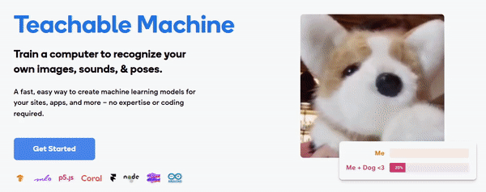
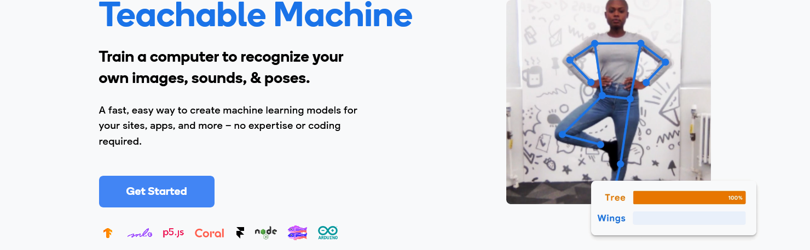
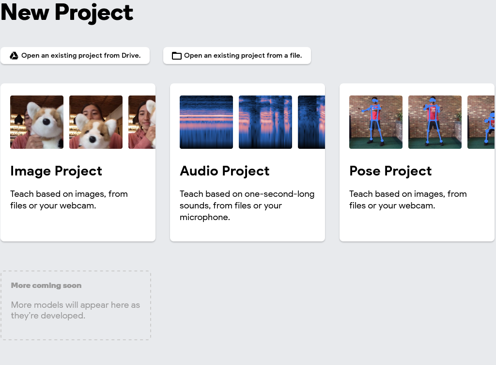
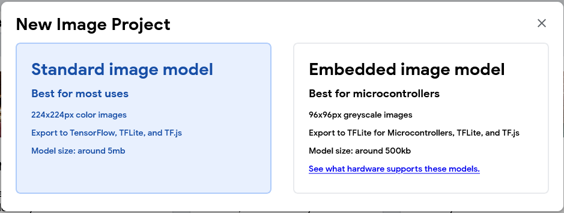
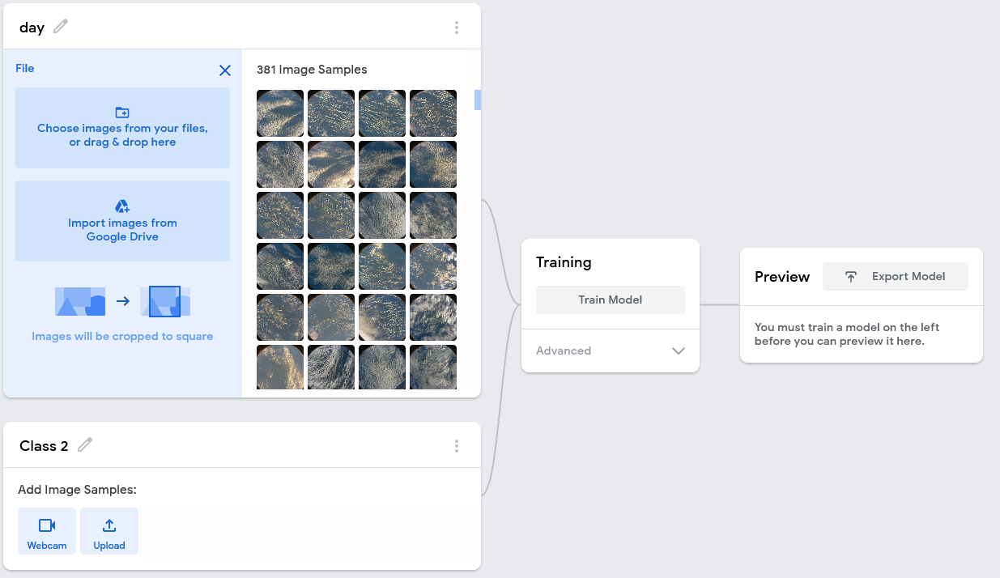
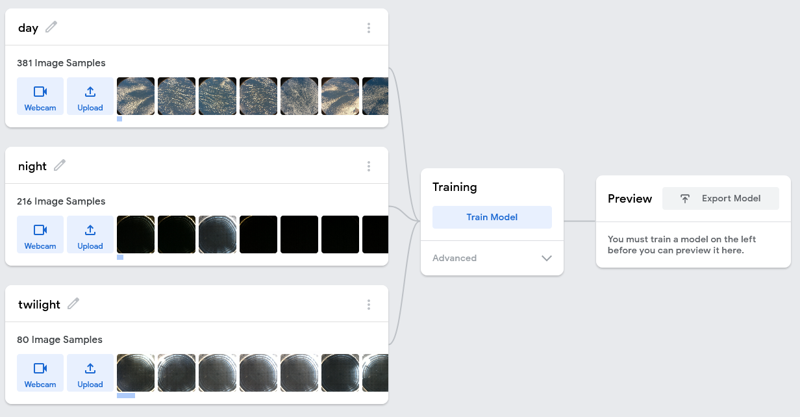
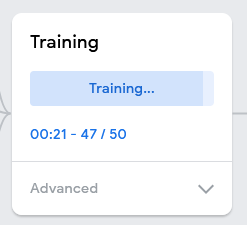
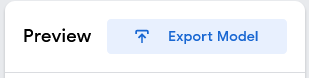
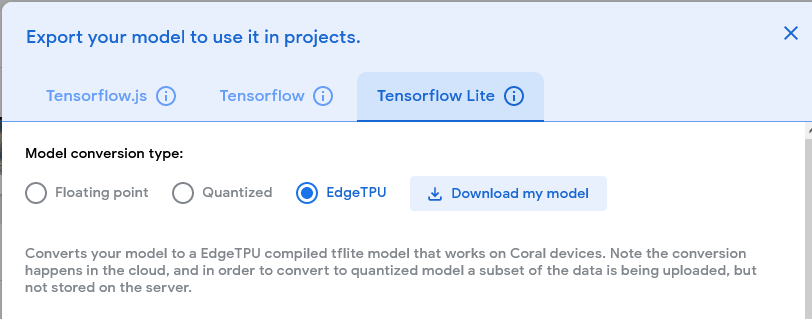

## Retrain a model with Teachable Machine

Teachable Machine allows you to easily retrain an image recognition model by uploading classified images to their site and using their cloud services to create a new model.

{:width="300px"}

--- task ---

In a browser window, navigate to the [Teachable Machine website](https://teachablemachine.withgoogle.com/){:target="_blank"}

--- /task ---

--- task ---

Click on the **Get Started** button.

--- /task ---

--- task ---

Choose to create an **Image Project**

--- /task ---

--- task ---

Select **Standard image model** when prompted.

--- /task ---

--- task ---

Rename **Class 1** to the name of your image directory, and then upload your images from that directory.

--- /task ---

--- task ---

Repeat this step for your other image directories.

--- /task ---

--- task ---

Click on the **Train Model** button, to retrain an existing image recognition model.

--- /task ---

--- task ---

Click on the **Export Model** button button.

--- /task ---

--- task ---

Select the **Tensorflow Lite** and **EdgeTPU** options and then **Download my model**.

--- /task ---