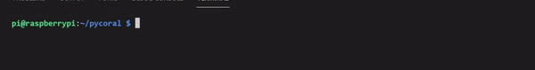
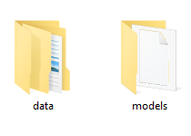
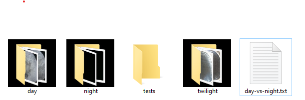
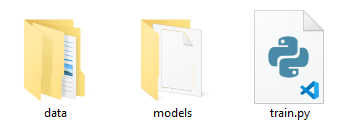
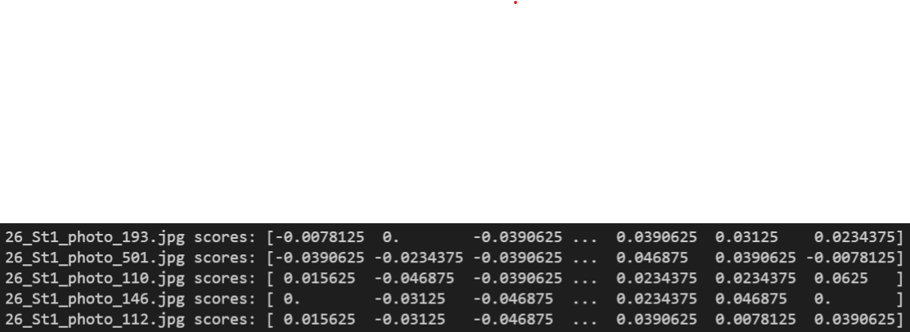
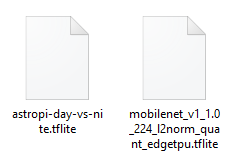

## Retrain a model on your Raspberry Pi

<div style="display: flex; flex-wrap: wrap">
<div style="flex-basis: 200px; flex-grow: 1; margin-right: 15px;">
You can also retrain an existing model using a Python script, that will run using your locally stored directories of images.
</div>
<div>
{:width="300px"}
</div>
</div>

To retrain a model on your computer, you will need to have your Coral TPU connected, your image directories organised, and a pre-trained model that you have downloaded.

--- task ---

Set up a directory structure on your computer so that you have directories for **data** and **models**.



--- /task ---

--- task ---

Into the **data** directory, you can move your classified image directories and your tests directory.


--- /task ---

--- task ---

Create a text file within the **data** directory, that contains the labels of the appropriate image directories, along with an ordering. In this example, the text file is called **day-vs-night.txt**.

--- code ---
---
language: python
filename: day-vs-night.txt
line_numbers: true
line_number_start: 
line_highlights: 
---
0 day
1 night
2 twilight
--- /code ---



--- /task ---

--- task ---

Download a pre-trained image recognition model [here](https://github.com/raspberrypilearning/image-id-coral/blob/master/en/resources/mobilenet_v1_1.0_224_l2norm_quant_edgetpu.tflite?raw=true).


Move the model file to your **models** directory.

--- /task ---

--- task ---

Download the training script [here](https://raw.githubusercontent.com/raspberrypilearning/image-id-coral/master/en/resources/train.py) and move it into the parent folder.



--- /task ---

--- task ---

Open the **train.py** script using a text editor or an IDE such as [Thonny](https://thonny.org/). 

Line `30` sets the name of the model you will output from the retraining.
Line `33` requires the name of your **label** file.

You can change these lines depending on the name of your **tflite model** and your **label** file.

--- code ---
---
language: python
filename: train.py
line_numbers: true
line_number_start: 26 
line_highlights: 30, 34
---
# the absolute path for the directory where this Python script is stored
script_dir = Path(__file__).parent.resolve()
# specify the input and output (retrained) model
model_path = script_dir/'models'/'mobilenet_v1_1.0_224_l2norm_quant_edgetpu.tflite'
out_model_path = script_dir/'models'/'astropi-day-vs-nite.tflite'
#  specify where the labels and labelled training data are
# note: this is the simple version, could accept command-line arguments
data_dir = script_dir/'data'
labels_path = data_dir/'day-vs-night.txt'
--- /code ---

--- /task ---

--- task ---

Run the script using your IDE or from your terminal.

```bash
python3 train.py
```

You should see an output similar to this.



--- /task ---

Your new model will be saved in the **models** directory.



--- collapse ---
---
title: What's the difference between this and Teachable Machine?
---

When you retrain the model on your own computer, you get to choose the model that you are retraining. With Teachable Machine, you are only ever using a model that has been chosen for you. By training on your computer, you have the opportunity to pick from a wide variety of different models, some of which might be better suited to the task you are trying to accomplish.

--- /collapse ---
