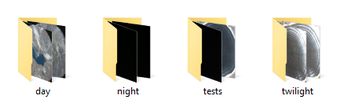

## Retrain a model with a script.

You can also retrain an existing model using a Python script, that will run using your locally stored directories of images.

{:width="300px"}

To retrain a model on your computer you will need to have your Coral TPU connected, your image directories, and a pre-trained model.

--- task ---

Set up a directory structure on your computer so that you have directories for **data** and **models**.

--- /task ---

--- task ---

Into the **data** directory, you can move your classified image directories and your test directory.

--- /task ---

--- task ---

Download a pre-trained image recognition model [here](https://github.com/raspberrypilearning/image-id-coral/raw/draft/en/resources/mobilenet_v1_1.0_224_l2norm_quant_edgetpu.tflite)

Move the model file to your **models** directory.

--- /task ---

--- task ---

Download the training script [here]() and move it into the parent folder.

--- /task ---

--- save ---