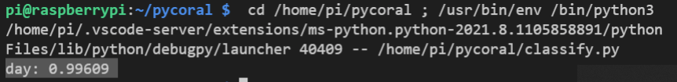
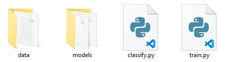

## Testing your new model

<div style="display: flex; flex-wrap: wrap">
<div style="flex-basis: 200px; flex-grow: 1; margin-right: 15px;">
Now that you have a trained model, it is time to use it to classify images.
</div>
<div>
{:width="300px"}
</div>
</div>

The script you are about to create will take a test image, and then run it through the model you have retrained, in an attempt to classify the image, and will provide a score for how confident the model is that the image has been correctly identified.

Again, in the examples here, we are using the images taken from the ISS, to classify if they were taken during the day, night, or at twilight.

--- task ---

Open up your Python IDE and create a new file called **classify.py**. Save the file in the same directory that holds your **data** and **models** directories.



--- /task ---

--- task ---

Add the imports shown below to the start of your file. `pathlib` will allow you to navigate the directory structure, `PIL` is used to resize the images, and `pycoral` is used to work with the Edge TPU.

--- code ---
---
language: python
filename: classify.py
line_numbers: true
line_number_start: 
line_highlights: 
---
from pathlib import Path
from PIL import Image
from pycoral.adapters import common
from pycoral.adapters import classify
from pycoral.utils.edgetpu import make_interpreter
from pycoral.utils.dataset import read_label_file
--- /code ---

--- /task ---

The next stage is to let your script know where all the files and directories are. To do this, it can use `pathlib` to get the name of the directory where the the script has been saved.

--- task ---

Add the following line of code, to resolve the directory where the script is saved.

--- code ---
---
language: python
filename: classify.py
line_numbers: true
line_number_start: 8
line_highlights: 8
---
script_dir = Path(__file__).parent.resolve()
--- /code ---

--- /task ---

Next, the directories and files required by the classifier need to be stored as paths, relative to where your Python script is saved. These include the model file, the data directory, the label file, and the image you will be using to test your classifier.

--- task ---

Add these four lines and change the names according to how you have named your model, label file, and which test image you want to use.

--- code ---
---
language: python
filename: classify.py
line_numbers: true
line_number_start: 10
line_highlights: 10-13
---
model_file = script_dir/'models/astropi-day-vs-nite.tflite' # name of model
data_dir = script_dir/'data'
label_file = data_dir/'day-vs-night.txt' # Name of your label file
image_file = data_dir/'tests'/'day_3.jpg' # Name of image for classification
--- /code ---

--- /task ---

Now the TensorFlow Lite interpreter needs to be set up to use the Coral's Edge TPU.

--- task ---

Add the following two lines to initialise the interpreter.

--- code ---
---
language: python
filename: classify.py
line_numbers: true
line_number_start: 15
line_highlights: 
---
interpreter = make_interpreter(f"{model_file}")
interpreter.allocate_tensors()
--- /code ---

--- /task ---

Machine learning models prefer to have all images at a set size, as this makes classification much simpler. If a model has been trained on images that are 224 pixels by 224 pixels, then it would make sense for any image fed into the model to have the same dimensions.

If you need your model to pick out finer details in an image, then the model would need to be trained using higher resolution images. This might be important if you were trying to classify images with specific features, such as coastlines in an Astro Pi image, or the colour of a person's eyes in headshots.

--- task ---

Add the following lines to find out the dimensions used for the model you have retrained, and then set the size of your test image to the same dimensions, using `PIL`.

--- code ---
---
language: python
filename: classify.py
line_numbers: true
line_number_start: 18
line_highlights: 
---
size = common.input_size(interpreter)
image = Image.open(image_file).convert('RGB').resize(size, Image.ANTIALIAS)
--- /code ---

--- /task ---

Now the image needs to be run through the model, to see how closely it matches any of the classes the model has been trained with.

--- task ---

Add these three lines, to classify your test image.

--- code ---
---
language: python
filename: classify.py
line_numbers: true
line_number_start: 21
line_highlights: 
---
common.set_input(interpreter, image)
interpreter.invoke()
classes = classify.get_classes(interpreter, top_k=1)
--- /code ---

--- /task ---

Lastly, the labels file can be used to provide a human readable class for the image. A score is also provided to tell you how confident the model is in its identification of the image.

--- task ---

--- code ---
---
language: python
filename: classify.py
line_numbers: true
line_number_start: 25
line_highlights: 
---
labels = read_label_file(label_file)
for c in classes:
    print(f'{labels.get(c.id, c.id)} {c.score:.5f}')
--- /code ---

--- /task ---

--- task ---

Run your code and you should see an output telling you the class for your image, and a percentage confidence.

```bash
day: 0.99609
```

--- /task ---

--- save ---
