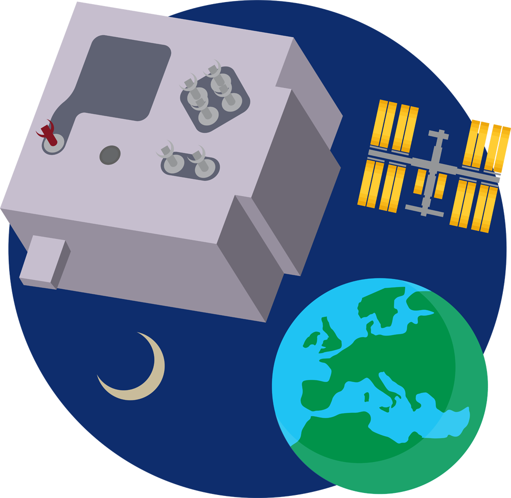

## Mission Space Lab

[Mission Space Lab](https://astro-pi.org/mission-space-lab/) is part of the European Astro Pi Challenge, an ESA Education project run in collaboration with the Raspberry Pi Foundation for young people aged 19 and under in [ESA Member States](https://astro-pi.org/mission-space-lab/eligibility), Slovenia, Latvia, Lithuania, Canada and Malta.
 
Mission Space Lab involves writing a computer program to run on one of the two Astro Pi units on the International Space Station, in order to conduct a scientific experiment exploring life on Earth or life in space. Each Astro Pi unit will have a Coral Machine Learning Accelerator attached to it.

{:width="300px"}

If you would like to enter Mission Space Lab, you might like to experiment with the [day, night, twilight](https://drive.google.com/drive/folders/1owb4zoZzSMld5qX0edCwZ1qZ6ypnJQ_5?usp=sharing) images provided.

There are other ways you could use the Coral and Machine Learning for your Mission Space Lab experiments though. With image recognition, you might like to try and experiment with detecting ocean, land, or coastlines. You could look for mountain ranges, lakes, or deserts.

With Machine Learning, you could also look at other data sources. You could analyse and then predict temperature changes on the ISS, or look into predicting orbital corrections.

If you want to learn more about using Coral, have a look through the examples and documentation at [https://coral.ai](https://coral.ai).
